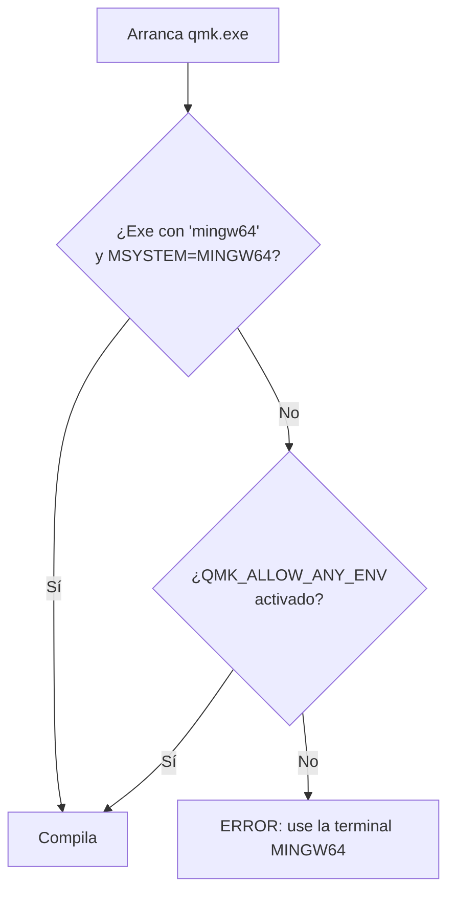
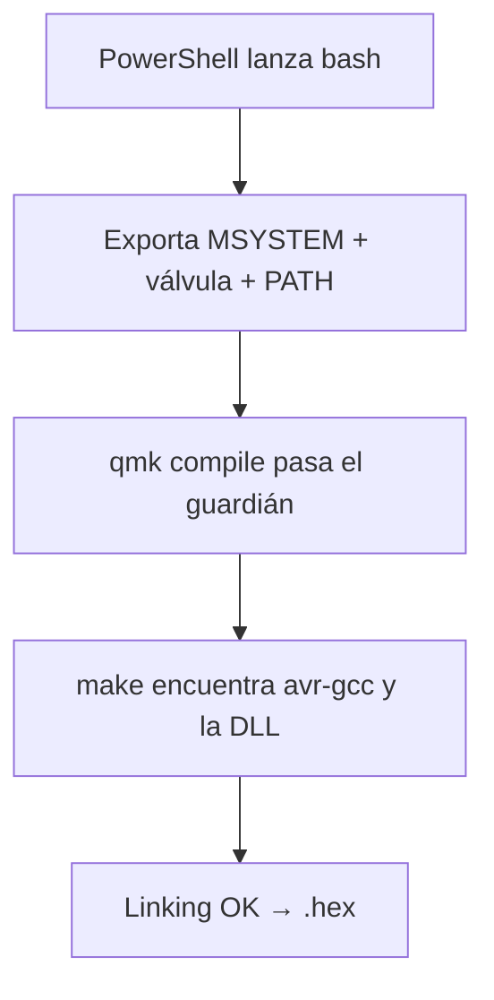

# 🛠️ Guía: compilar el keymap en Windows

Cómo quedó configurado el entorno de compilación el 2026-09-06 y cómo repetirlo. Si vienes de cero, sigue el §3 una sola vez; para compilar, salta al §4.

---

## 1. El mapa: quién hace qué

Nada compila solo: son cuatro piezas encadenadas. Tú hablas con MSYS, MSYS despierta al CLI, el CLI maneja `make`, y `make` usa el compilador AVR.


| Pieza | Dónde vive | Estado en que la encontramos |
|---|---|---|
| `QMK_MSYS` (bash, make) | `C:\QMK_MSYS` | Instalado pero incompleto: sin python, sin CLI |
| Toolchains AVR/ARM | `C:\QMK_MSYS\opt\qmk\bin` | Presentes pero cojos: a `avr-gcc` le faltaba una DLL |
| CLI de QMK | Python 3.11 de Windows + `Scripts\qmk.exe` | No instalado |
| Firmware | `C:\Users\Usuario\qmk_firmware` (rama `my-corne`) | Listo |

---

## 2. El guardián: por qué QMK no quería correr

El CLI trae un guardián en `qmk_cli/script_qmk.py:83` que solo deja pasar si detecta **su terminal oficial** (MINGW64). La idea es sana: fuera de ese entorno las compilaciones salen rotas por herramientas equivocadas. El problema es que nuestro MSYS nunca terminó de instalarse, así que el guardián bloqueaba hasta el entorno correcto.



Lo cumplimos por las dos vías a la vez: corremos **dentro del bash real de MSYS** con `MSYSTEM=MINGW64` (espíritu del guardián: herramientas reales), más una válvula reversible `QMK_ALLOW_ANY_ENV=1` porque nuestro python es el de Windows y su ruta no contiene la palabra `mingw64`. Sin la válvula, el guardián nunca pasa aunque todo lo demás esté bien.

---

## 3. Configuración (una sola vez)

**3.1. Python dentro de MSYS** (el CLI lo necesita para algunas llamadas internas):

```sh
pacman -S --needed --noconfirm python python-pip
```

**3.2. CLI de QMK en el Python de Windows** (en MSYS falla compilando `rpds-py`; en Windows hay rueda lista):

```powershell
python -m pip install qmk
```

Dos trampas documentadas:
- El módulo **no** se importa como `qmk` sino como `qmk_cli`; lo que se ejecuta es `C:\Users\Usuario\AppData\Local\Programs\Python\Python311\Scripts\qmk.exe`.
- Si la instalación queda rota (metadata sin archivos), reparar con `python -m pip install --force-reinstall --no-deps qmk`.

**3.3. Válvula del guardián** (reversible, una sola vez). En `.../Python311/Lib/site-packages/qmk_cli/script_qmk.py`, después del chequeo `mingw64`, agregar:

```python
        # Escape hatch for MSYS bash with Windows python (local agent use)
        if os.environ.get('QMK_ALLOW_ANY_ENV'):
            env_ok = True
```

**3.4. Shim `qmk` para `make`.** El sistema de compilación invoca un ejecutable llamado `qmk` (sin extensión). Crear `/usr/local/bin/qmk` (con fines de línea LF) y darle permiso:

```sh
#!/bin/sh
export QMK_ALLOW_ANY_ENV=1
exec /c/Users/Usuario/AppData/Local/Programs/Python/Python311/Scripts/qmk.exe "$@"
```

```sh
chmod +x /usr/local/bin/qmk
```

**3.5. La DLL faltante.** `avr-gcc` es un binario nativo de Windows y pedía `libwinpthread-1.dll`, que vive en `/mingw64/bin`. No se instala nada: basta agregar `/mingw64/bin` al `PATH` al compilar (ver §4).

---

## 4. Compilar (cada vez)

Un solo comando desde PowerShell (ojo con el backtick delante de `$PATH`, si no PowerShell lo expande):

```powershell
& "C:\QMK_MSYS\usr\bin\bash.exe" --login -c "export MSYSTEM=MINGW64 QMK_ALLOW_ANY_ENV=1; export PATH=/usr/local/bin:/opt/qmk/bin:/mingw64/bin:/usr/bin:/bin; cd /c/Users/Usuario/qmk_firmware && qmk compile -kb crkbd/rev1 -km cornekeymap"
```



**Éxito se ve así** (cola del log). El `.hex` canónico vive en `.build/` (el duplicado que QMK deja en la raíz se elimina):

```text
Linking: .build/crkbd_rev1_cornekeymap.elf                        [OK]
Creating load file for flashing: .build/crkbd_rev1_cornekeymap.hex [OK]
Copying crkbd_rev1_cornekeymap.hex to qmk_firmware folder          [OK]
 * The firmware size is fine - 24126/28672 (84%, 4546 bytes free)
```

Ruta final: `.build/crkbd_rev1_cornekeymap.hex` — es la que se abre con QMK Toolbox para flashear.

---

## 5. Si algo falla: tabla de rescate

| Error | Causa real | Arreglo |
|---|---|---|
| `'qmk' is not recognized` (PowerShell) | El CLI no está en el PATH de Windows | Usar la ruta completa a `Scripts\qmk.exe` o el shim del §3.4 |
| `No module named 'qmk'` | El paquete se llama `qmk_cli` | Ejecutar `qmk.exe`, no `python -m qmk` |
| `ERROR: ... MINGW64 terminal` | El guardián del §2 | Correr dentro de MSYS con `MSYSTEM=MINGW64` + válvula del §3.3 |
| `make: qmk: No such file` / `Platform not defined` | `make` invoca `qmk` y no lo encuentra | Shim del §3.4 + `/usr/local/bin` en el PATH |
| `Error 127` en `gccversion` | `avr-gcc` no ejecuta (DLL) | Agregar `/mingw64/bin` al PATH (§3.5) |
| `pip` falla con `rpds-py` (MSYS) | Sin rueda para MSYS ni Rust para compilarla | Instalar `qmk` en el Python de Windows (§3.2) |
| `externally-managed-environment` (PEP 668) | MSYS protege su python | `--break-system-packages` (igual conviene el camino Windows) |
| Avisos `Feature X is specified in both info.json and rules.mk` | Ruido preexistente del teclado, gana `rules.mk` | Ignorar |

---

## 6. Notas

- El `.hex` canónico es `.build/crkbd_rev1_cornekeymap.hex` (ignorado por git junto con `.build/`): no se commitea, se regenera. La copia que QMK deja en la raíz se elimina para no duplicar.
- La válvula `QMK_ALLOW_ANY_ENV` solo vive en tu `site-packages` local; si reinstalas el paquete `qmk`, hay que re-aplicar el §3.3.
- Referencia viva del flujo en `tasks/pending.md` (Tarea 3); historial de decisiones en `tasks/completed.md` al cerrar.
